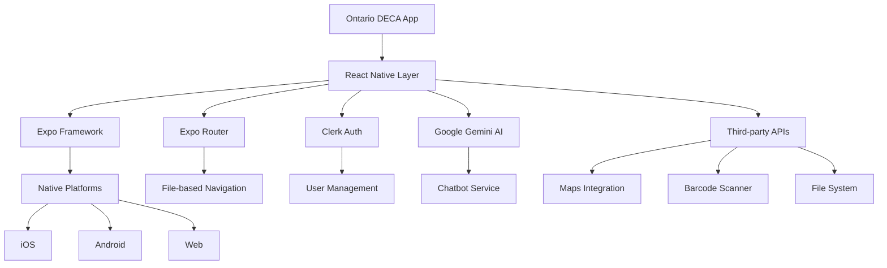
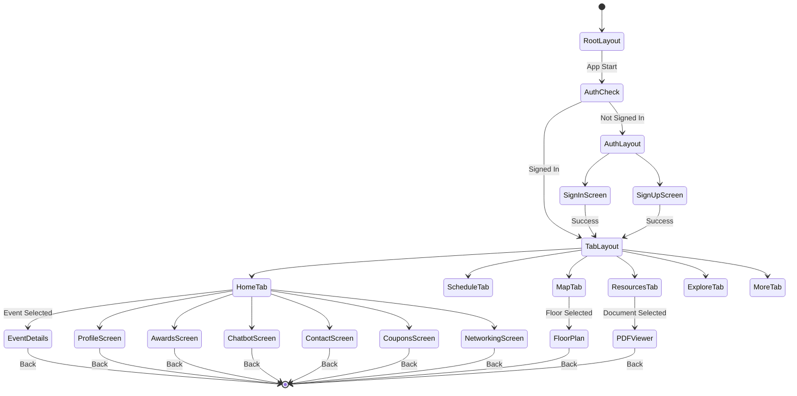
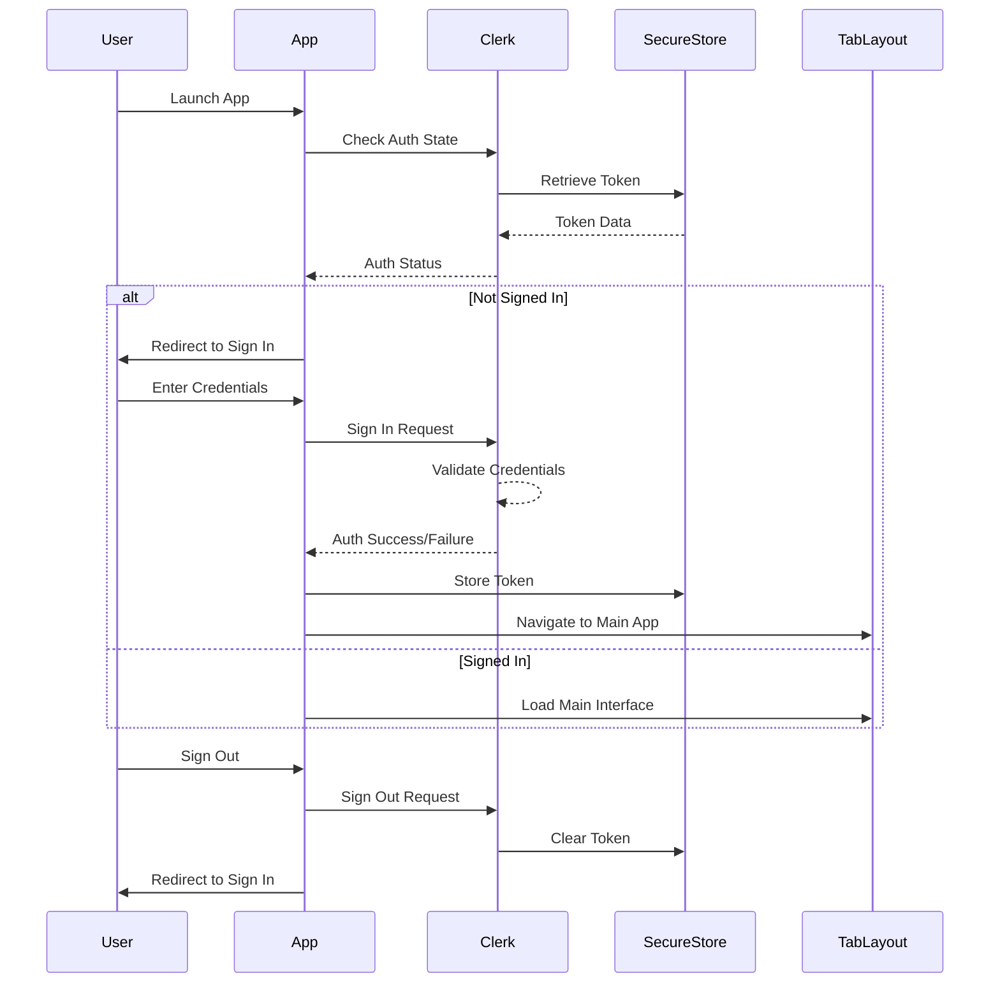
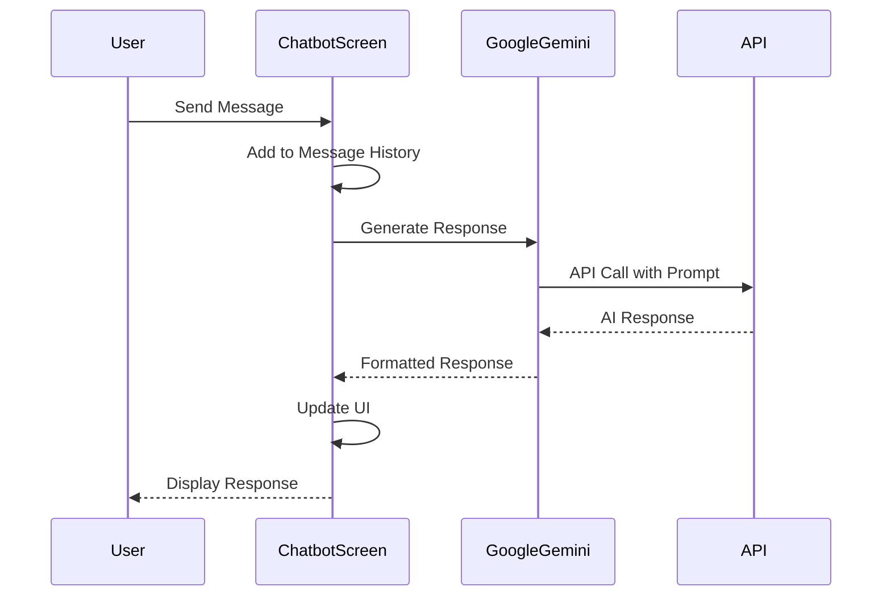
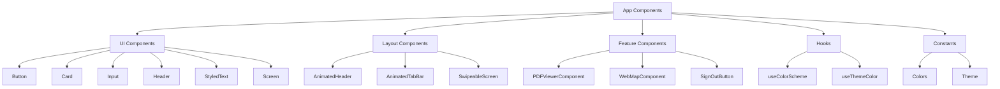

# Ontario DECA App Architecture

## Overview

The Ontario DECA App is a cross-platform mobile application built with React Native and Expo, designed to support DECA (Distributive Education Clubs of America) Provincials events. The app provides features for event navigation, networking, resource access, and AI-powered assistance.

## Application Structure

### Technology Stack

- **Framework**: React Native 0.81.4 with Expo SDK 54
- **Language**: TypeScript
- **Navigation**: Expo Router (file-based routing) with React Navigation
- **Authentication**: Clerk Authentication
- **AI Integration**: Google Generative AI (Gemini)
- **State Management**: React hooks and context
- **Styling**: Custom theme system with color constants
- **Build System**: Expo CLI with support for iOS, Android, and Web

### Directory Structure

```
ontario-deca/
├── app/                          # Main application screens (Expo Router)
│   ├── _layout.tsx              # Root layout with Clerk provider
│   ├── (auth)/                  # Authentication screens
│   │   ├── _layout.tsx          # Auth layout with redirect logic
│   │   ├── sign-in.tsx          # Sign-in screen
│   │   └── sign-up.tsx          # Sign-up screen
│   ├── (tabs)/                  # Main tab navigation
│   │   ├── _layout.tsx          # Tab layout with auth guard
│   │   ├── index.tsx            # Home screen
│   │   ├── schedule.tsx         # Event schedule
│   │   ├── map.tsx              # Venue map
│   │   ├── resources.tsx        # Resource library
│   │   ├── explore.tsx          # Explore features
│   │   └── more.tsx             # Additional options
│   ├── awards.tsx               # Awards screen
│   ├── chatbot.tsx              # AI assistant
│   ├── contact.tsx              # Contact information
│   ├── coupons.tsx              # Coupons/discounts
│   ├── modal.tsx                # Modal screens
│   ├── networking.tsx           # Networking features
│   ├── profile.tsx              # User profile
│   ├── event-details/[id].tsx   # Dynamic event details
│   ├── floor-plan/[floor].tsx   # Dynamic floor plans
│   └── pdf-viewer/[id].tsx      # PDF document viewer
├── components/                  # Reusable UI components
│   ├── ui/                      # Core UI components
│   │   ├── Button.tsx
│   │   ├── Card.tsx
│   │   ├── Header.tsx
│   │   ├── Input.tsx
│   │   ├── Screen.tsx
│   │   └── StyledText.tsx
│   ├── AnimatedHeader.tsx
│   ├── AnimatedTabBar.tsx
│   ├── PDFViewerComponent.tsx
│   ├── SignOutButton.tsx
│   ├── SwipeableScreen.tsx
│   ├── WebMapComponent.tsx
│   └── ...
├── constants/                   # App constants
│   ├── colors.ts                # Color definitions
│   └── theme.ts                 # Theme configuration
├── hooks/                       # Custom React hooks
│   ├── use-color-scheme.ts
│   ├── use-color-scheme.web.ts
│   └── use-theme-color.ts
├── assets/                      # Static assets
│   └── images/                  # App icons and images
└── scripts/                     # Build and utility scripts
    └── reset-project.js
```

### Key Components

#### Navigation Architecture
- **Root Layout** (`app/_layout.tsx`): Provides Clerk authentication context and theme provider
- **Auth Layout** (`app/(auth)/_layout.tsx`): Handles authentication flow with automatic redirects
- **Tab Layout** (`app/(tabs)/_layout.tsx`): Main app navigation with authentication guards
- **Dynamic Routes**: Event details, floor plans, and PDF viewers use dynamic routing

#### Authentication System
- **Provider**: Clerk handles user authentication and session management
- **Token Storage**: Expo Secure Store for persistent authentication tokens
- **Route Guards**: Automatic redirects based on authentication state

#### UI Components
- **Themed Components**: Consistent styling with DECA brand colors
- **Animated Elements**: Smooth transitions and interactive feedback
- **Platform-Specific**: Optimized components for iOS, Android, and Web

## Architecture Diagrams

### High-Level System Architecture



### Navigation Flow Architecture



### Authentication Data Flow



### Chatbot Data Flow



### Component Architecture



## Data Flow Patterns

### Authentication Flow
1. **App Launch**: Check for existing authentication tokens in secure storage
2. **Token Validation**: Clerk validates tokens with backend services
3. **State Management**: Authentication state propagates through React context
4. **Route Protection**: Navigation guards redirect based on auth status
5. **Session Persistence**: Tokens automatically refreshed and stored securely

### User Interaction Flow
1. **Screen Navigation**: Expo Router handles route changes and parameter passing
2. **State Updates**: Local component state managed with React hooks
3. **API Calls**: External services called through dedicated service layers
4. **Error Handling**: User-friendly error messages with retry mechanisms
5. **Offline Support**: Cached data and offline-first approach where applicable

### AI Integration Flow
1. **User Input**: Text input captured through UI components
2. **Prompt Processing**: Input formatted for AI service requirements
3. **API Communication**: Secure API calls to Google Gemini
4. **Response Parsing**: AI responses processed and formatted for display
5. **Conversation History**: Message history maintained for context

## Security Considerations

- **Token Storage**: Sensitive data stored in Expo Secure Store
- **API Keys**: Environment variables for external service credentials
- **Authentication**: Clerk handles secure authentication flows
- **Data Transmission**: HTTPS for all external communications
- **Input Validation**: Client-side validation with server-side verification

## Performance Optimizations

- **Code Splitting**: Expo Router enables automatic code splitting
- **Image Optimization**: Expo Image for efficient image loading
- **Animation Performance**: React Native Reanimated for smooth animations
- **Memory Management**: Proper cleanup of subscriptions and timers
- **Bundle Size**: Tree shaking and minimal dependencies

## Deployment

- **Platforms**: iOS, Android, and Web support through Expo
- **Build Process**: Expo CLI handles native builds and optimizations
- **Distribution**: App Store, Google Play, and web hosting
- **CI/CD**: Automated builds and deployments through Expo services
